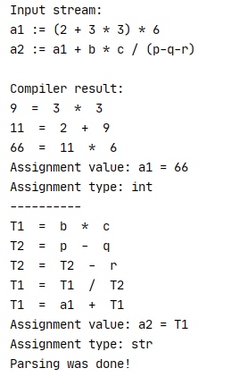

# Compiler course code sniptes
This repository contains several code snippets that I developed to teach the ANTLR compiler generator at Iran University of Science and Technology (UST). Grammars have been written in ANTRL v4 format. For each grammar, the source code of Lexer and Parser is available in Python 3.x. 
The repository is assumed to be updated regularly. It would be appreciated if you use this repository by forking it. For any question please contact me    `m-zakeri@live.com` or read [documentation](https://m-zakeri.github.io/IUSTCompiler/).

## Examples
The following figure shows how a single pass compiler can generate three address code for assignment statements with a minimal number of temp variables:

## Structure
The following describes the structure of the repository:

### grammars

`gram1`: ANTRL hello world grammar.

`Expr1`: Simple grammar for handling mathematical expressions without any attribute and action.

`Expr2`: Simple attributed grammar for handling mathematical expressions with code() attribute.
 
`Expr3`: Currently, it is the same `Expr2` grammar.

`AssignmentStatement1.g4`: The grammar to handle multiple assignment statements and mathematical expressions in programming languages like *Pascal* and *C/C++*. 

`AssignmentStatement2.g4`: It is the same `AssignmentStatement1.g4` grammar with attributes for holding rule code and rule type.

`AssignmentStatement3.g4`: The grammar to handle multiple assignment statements and mathematical expressions in programming languages like *Pascal* and *C/C++*. It provides semantic rules to perform type checking and semantic routines to generate intermediate representation.

`AssignmentStatement4.g4`: The grammar to handle multiple assignment statements and mathematical expressions in programming languages like *Pascal* and *C/C++*. It provides semantic rules to perform type checking and semantic routines to generate intermediate representation. It has been implemented to generate intermediate representation (three addresses codes) with minimum number of "temp" variables. 

`CPP14_v2`: ANTLR grammar for C++14 forked from the official ANTRL website. Some bugs have been fixed and also the rule identifiers have been added to the grammar rules.

`EMail.g4`: Lexical grammar to validate email addresses.

`EMail2.g4`: Lexical grammar to validate email addresses, fixing bugs in `EMail.g4`

### code
The `code` package currently contains Lexer and Parser codes for each grammar in directory `grammars`, with a main driver script to demonstrate the *type checking* and *intermediate code generation* based on **semantic rules** and **semantic routines**. 

## Read more
[IUST compiler course official webpage](http://parsa.iust.ac.ir/courses/compilers/)

ANTLR slides: PART 1: [Introduction](http://parsa.iust.ac.ir/download_center/courses_material/compilers/slides/ANTLR_part1_introduction.pdf)

ANTLR slides: PART 2: [Getting started in Java](http://parsa.iust.ac.ir/download_center/courses_material/compilers/slides/ANTLR_part2_getting_started_in_Java.pdf)

ANTLR slides: PART 3: [Getting started in C#](http://parsa.iust.ac.ir/download_center/courses_material/compilers/slides/ANTLR_part3_getting_started_in_CSharp.pdf)

 